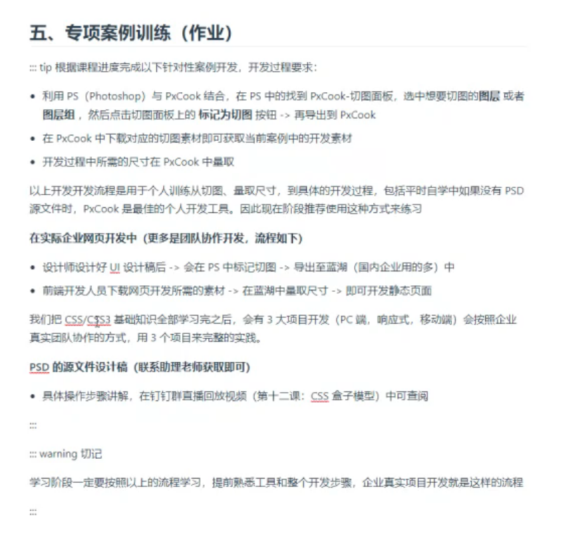

# 01-Flexible Box Layout

- Conventional layout by `float` & `position` is well-supported and compatible, but is buggy.
  - Collapse issue.
  - Cumbersome when applying layout to mobile devices.
  - As a fallback to older browser support.
- Flexbox is easy to use, and simple to apply layout to mobile devices.

## Concepts

1. What is Flex?
2. What is flex containers and flex item?
3. What is the main axis and cross axis?
4. Default flex item behaviours

### What is Flex?

- flex is shortform of flexbox.
- a new css layout mode.
- flexbox gives the power to its children for alignment and space distribution.
- one-dimensional, deals only for row or column.

### What is flex containers and flex items?

- the element applied flex will be the flex containers, and all its direct children becomes flex items.
- display sets an element's inner and outer display types.
  - `display: flex;`: makes the flex container (parent) display block (outer type) and inner display type as flex.
  -  `display: inline-flex;`: makes the flex container (parent) display inline-block (outer type) and inner display type as flex - you can set height and width too, this is the difference from inline in which you can't.
-  any element can be set as flex.
-  no margin collapse in flex items (children). To know more,[Mastering_margin_collapsin](https://developer.mozilla.org/en-US/docs/Web/CSS/CSS_box_model/Mastering_margin_collapsing)
- `float`, `clear`, and `vertical align` will not work in flex item.


```html
<style>
    .flex-container {
        display: flex;
        
        background-color: skyblue;
    }

    .inline-flex-container {
      /* Width takes up as much as the total width occupied by its children. */
      /* Note you can also specify the width and height yourself. */
        display: inline-flex; 
      background-color: skyblue;
    }

    .flex-item {
        width: 100px;
        height: 100px;
        margin: 10px;
        background-color: pink;
    }
</style>

<body>
    <!-- Flex -->
    <div class="flex-container">
      <div class="flex-item">Flex Items</div>
      <div class="flex-item">Flex Items</div>
      <div class="flex-item">Flex Items</div>
      <div class="flex-item">Flex Items</div>
    </div>
    <br />
    <!-- Inline-Flex -->
    <div class="inline-flex-container">
      <div class="flex-item">Flex Items</div>
      <div class="flex-item">Flex Items</div>
      <div class="flex-item">Flex Items</div>
      <div class="flex-item">Flex Items</div>
    </div>
  </body>
```


### What is main axis and cross axis?

- there's two axes in a flex container: the horizontal main axis and vertical cross axis.
- main start: starting point of main axis, main end: end point of main axis.
- cross start: starting point of cross axis, cross end: end point of cross axis.
- main size: the space in the main axis occupied by the single flex item, cross size: the space in the cross axis occupied by the single flex item.
- By default, flex items align along the main axis.


### Default flex item behaviours

- when we do not apply flex container / flex item related props, the default behaviours of flex items are as follow:
  - `flex-direction: row`
  - alignment along the main axis.
  - do not extend along the main axis, unless the flex container is too small, it will shrink to fit in.
  - extend to fit the size available in the cross axis when height is not specified (flex item height = container height when it is only single line). If specified height, display based on height set.
  - `flex-basis : auto;` : width as content width, unless specified AND the flex container is able to accomodate all flex items.
  - `flex-wrap: nowrap;`: do not wrap when there's no more space.

## Flex Container Properties

The following properties are set on the flex container (parent).

- `flex-direction` : set the direction of main axis (cross axis is not affected).
  - row (default): left to right
  - row-reverse: right to left
  - column: top to bottom
  - column-reverse: bottom to top
- `flex-wrap` : set whether the flex items will wrap onto multiple lines when there isn't enough space in the container to fit them all on a single line.
  - nowrap (default)
  - wrap
  - wrap-reverse
- `flex-flow: flex-direction flex-wrap`: shorthand property for `flex-direction` and `flex-wrap`.
  - default: row nowrap
- `justify-content`: set the alignment of flex items on the main axis. 
  - flex-start (default - though in MDN the initial value of justify-content is normal, and normal seems to have many meaning depending on the context of the layout mode)
  - flex-end
  - center
  - space-between
  - space-around
  - space-evenly
  > Confusion about the default value of justify content: [Default value of Justify Content](https://stackoverflow.com/questions/57720598/what-is-the-default-value-of-justify-content)
- `align-items`: set the alignment of flex items on the cross axis. (single line).  Note: The group of flex items is seemed to be the one entity.
  - stretch (default): when we do not set height on flex items or set as auto, the flex item will take up as much space as the container height.
  - flex-start
  - flex-end
  - center
  - baseline: all flex items align based on baseline (e.g., the baseline of the text) - rarely used.
  
  > **Space Distribution between multiple flex lines.**
  
  ```js
  // Question: How does the space occupation by each flex lines being calculated / distributed?
  const sharedSpacePerLine = flexContainerHeight - sumOfTheHighestFlexItemOfEachFlexLine / numberOfFlexLines;
  // 800px - 200px - 100px = 500 / 2 = 250 
  const flexLineSpace = highestFlexItem + sharedSpcePerLine;
  /*
   flex line 1: 
   200px (Highest Item) + 250px  (Shared Space)= 450px
  
   flex line 2: 
   100px (Highest Item) + 250px  (Shared Space)= 350 

   Therefore, this is why flex line 1 has more height compared to flex line 2.
   Note that the space occupied by each flex line is not necessarily equal. Though the shared space is evenly distributed.
   It is pretty much dependent on the tallest flex item on that line.
   */
  ```
- `align-content`: control the space between **flex lines** on the cross axis (multiple lines). If there's only one flex line, this property would not work.
  - stretch (Default)
  - flex-start
  - flex-end
  - center
  - space-between
  - space-around
  - space-evenly

> Note: **flex lines**** refers to the group of flex items that forms a single line after wrapping.


## Flex Item Properties

- `order`: set the order of flex item. 
  - the higher the value, the further back the item will be placed.
  - default: 0 for all items.
  - With similar order, the item appears at the front in the source code will be put first.
  - only works on element with display flex & grid.
  - only affects the visual effect, not the logical / tab order.
- `align-self`: override the align-items property, and allows individual flex item having their own alignment along the cross axis. 
  > Note: when wrapping happens, there will be more than one flex lines, and each flex lines will be its own compartment. The align-self will be taken effect on each compartment.
  - auto: default, inherits parent align-items property. Without parent, it is equal to stretch.
  - stretch: occupy the flex container height, when we do not set height of the flex item, or the flex item height is auto.
  - flex-start
  - flex-end
  - center
  - baseline: ligns based on the baseline of the first line of text in the flex item
    - first baseline: same as baseline.
    - last baseline: based on last line.
- `flex-grow`: set the flex grow factor of flex item's main size. The main size (width or height) depends on the flex-direction.
  - works only when the flex container has positive free space that can be distributed.
  - positive free space = flex container size - Sum of flex item size.
  - the free space must be > 0. Otherwise, it will not be enlarge.
  - default: 0, meaning that when there's positive free space, it will not grow.
  - calculation for > 0 flex-grow value
    - when the sum of flex-grow value of all items < 1,
      - `resultingWidth = flexItemNaturalSize + positiveFreeSpace * flexGrow`
    - when the sume of flex-grow value of all item >= 1,
      - `resultingWidth = flexItemNaturalSize + positiveFreeSpace * flexGrow / totalFlexGrowOfAllItems`
- `flex-shrink`: set the flex shrink factor, which determines how much the flex item will shrink relative to the rest of the flex items in the flex containner when negative free space is distributed.
  - shrinking happens when all sumOfAllFlexItemNaturalSize > containerSize.
  - default: 1, when the container size is not enough to fit in all the flex items, all flex items will  hrinkk in a equal proportion.
  - only take effect when the flex container do not allow wrapping `flex-wrap: nowrap`
  - To understand more about how shrinking calculation works: [
Controlling ratios of flex items along the main axis](https://developer.mozilla.org/en-US/docs/Web/CSS/CSS_flexible_box_layout/Controlling_ratios_of_flex_items_along_the_main_axis#important_concepts_when_working_on_the_main_axis)
  - rule of thumbs:
    - totalFlexGrow < 1, not shrink completely into the flex container.
    - totalFlexGrow > 1, shrink completely into the flex container.
    - content size must be taken into account, shrinking will not shrink below content size.
- `flex-basis`: set initial size (main size) a flex item before any distribution of the positive or negative free space happens.
  - default: auto
- `flex`: a shorthand of flex-grow, flex-shrink, and flex-basis.
  - default: 0 1 auto
  - three ways of writing:
    - one value:
      - a. `flex: <flex-grow> 1 0`
        - `flex: 1`  equivalent to `flex: 1 1 0` (without unit, it is flex-grow, note: this flex item doesn't have flex-basis. when there's no content in the flex item, and the items before it has occupied the remaining space, it will not be shown on the screen.)
      - b. `flex: 1 1 <flex-basis>`
        - `flex: 1px` equivalent to `1 1 1px` (when specify px, it will be flex-basis)
      - keywords: 
        - `initial`: flex: 0 1 auto
        - `auto`: 1 1 0 (support flexbox)
        - `none`: 0 0 auto (do not support flexbox)
    - two values:
      - a. flex-shrink: `flex: <flex-grow> <flex-shrink> 0`
        -  `flex 1 1` (equivalent to 1 1 0)
      - b. flex-basis: `flex: <flex-grow> 1 <flex-basis>`
        - `flex: 1 auto` (equivalent to flex: 1 1 auto)
    - three values:  `flex: <flex-grow> <flex-shrink> <flex-basis>`

