# Grid

## Basic Concepts
### 1. What is Grid?
- divide a container into rows and column, creating a grid of cells that can accommodate individual grid items, and we can specify the placement of grid item in each grid cell. 
- 2-dimensional layout.
- Unlike Flexbox, which is best suited for one-dimensional layouts, grid is more powerful and suitable for layouts that spans both rows and columns simultaneously.


### 2. What is a grid container and item?

- the element that has display set to `grid` is the grid container, and its direct children become `grid item`.
- display:
  - `grid`: element presents itself as block element.
  - `inline-grid`: element presents itself as inline-block element.
  - any element can be grid layout.

### 3. What is row, column, and cell?

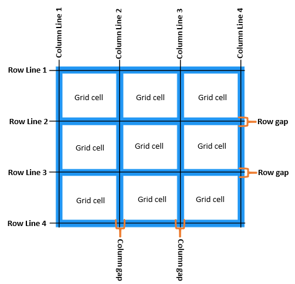
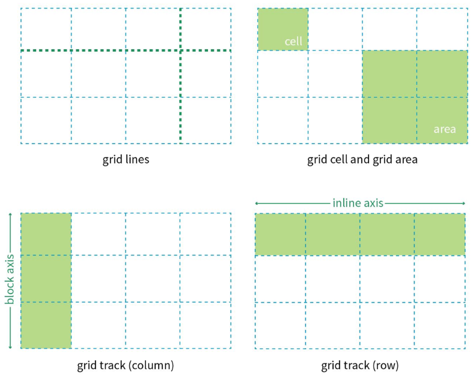
- row: horizontal area
- column: vertical area
- cell: the intersection area between row and column.
- number of cells: n (row) * m (column)

### 4. What is grid line?

- grid lines: the lines that divide the grid container vertically and horizontally.
- horizontal lines divides into rows
- vertical lines columns divides into columns.
- n rows: n + 1 horizontal grid lines.
- m columns: m + 1 vertical grid lines.

### 5. What is grid track?

- grid tracks: the space / area between two grid lines.
- types: 
  - horizontal tracks
  - vertical grid tracks

### 6. What is grid area?
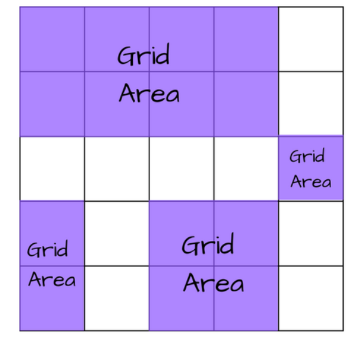
- grid area: the rectangular area made up of one or more adjacent grid cells (a bit like merge).
- note: you need to count the one grid cell as grid area too.
- we can perform merge operation on those grid cells.

### 7. What is gutter?
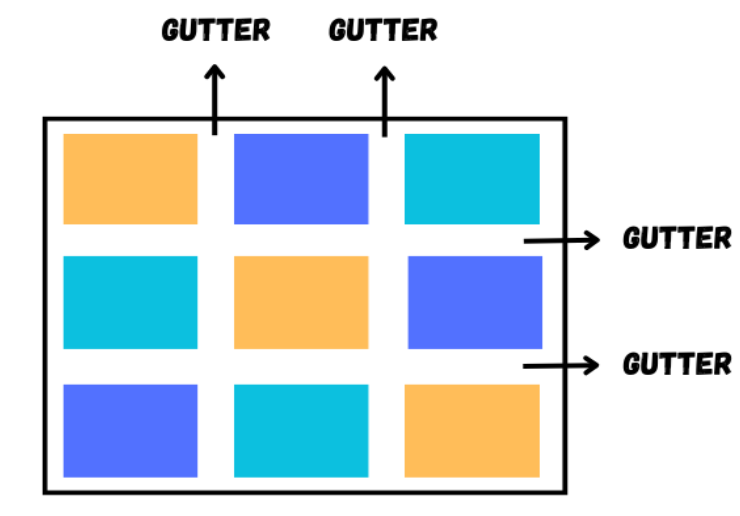

- gap / the space between two rows / two columns.
- gutter between two rows is `row-gap`.
- gutter between two columns is `column-gap`.

### 8. What is grid content area?

- each child of the grid container is `grid item` and grid content area is a group of grid item.
- grid content area doesn't necessarily occupy the entire grid container.

## Grid Container Properties
> note: Chrome Dev tool Grid Track size is wrong -> Due to Window Display Scale issue.
> Solve when change the scale to 100%.
> 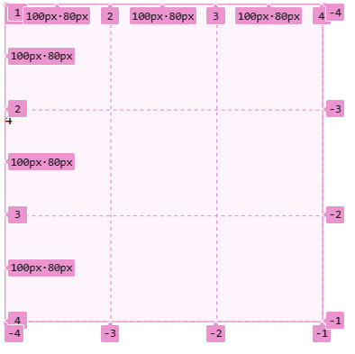
### `grid-template-columns` & `grid-template-rows`
- `grid-template-columns`: specify columns and column width.
- `grid-template-rows`: specify rows and row height.
- values:
  1. `px` (absolute length unit)
  2. `%`: relative to grid container width and height
  3. `fr`: fraction a grid item occupied.
     - used to represent fraction.
     - if all rows / columns use fr unit:
       - each column width = containerWidth * (currentItemFr / totalFr)
       - each row height = containerHeight * (currentItemFr / totalFr)
  4. `auto`: 
   - auto-calculate the row height and column width of the grid cell.
   - columnWidth & rowHeight of a grid cell is always >= the inner element's width & height
  5. `repeat()`: use to repeat similar values.
   - repeat(times, values) 
   - repeat(times, pattern)
   - repeat(auto-fill, values)
     - `auto-fill` keyword: used when grid cell size is fixed, but the container size is not sure and hope to accommodate as many grid cells for each row / column as possible.
     - auto-fill will help us with the calculation of the number of columns / rows needed based on the container size we specify later.
     - auto-fill will take the round-down value after calculation. (e.g., 4.8 it will take 4.)
  6. `minmax(val1, val2)`: generate a range of length
  7. specify names of grid lines in `grid-template-columns` & `grid-template-rows` in square bracket for future reference.
### `row-gap` & `column-gap` & `gap`

- In early days, the naming of these properties are `grid-row-gap`, `grid-column-gap`, and `grid-gap`.
- Based on the latest standard, the grid- prefix has been removed.
- `gap: <row-gap> <column-gap>` is the shorthand property of `row-gap` & `column-gap`.
  - if you specify one value for gap, then both column gap and row gap are having equal size.
  - `gap: 10px 20px`
- `row-gap` : set the gap between rows.
- `column-gap` : set the gap between columns.
- values can be in absolute unit (px) or percentage (%).
  - px
  - % : it is relative to grid container.

### `grid-template-areas` & `grid-area`

- specify named grid areas, where a grid area can be consisted of a single cell or more cells.
- must write this property together with another property `grid-area`.
- `grid-area` property is used to specify where the current grid item belong to which grid area.
  - it is written on grid item.
  - value of `grid-area` is the area name.
- when specifying areas, grid lines of each area will be affected. The start and end of each grid line will be named as `area-start` & `area-end` respectively.
  - vertical & horizontal.
  - 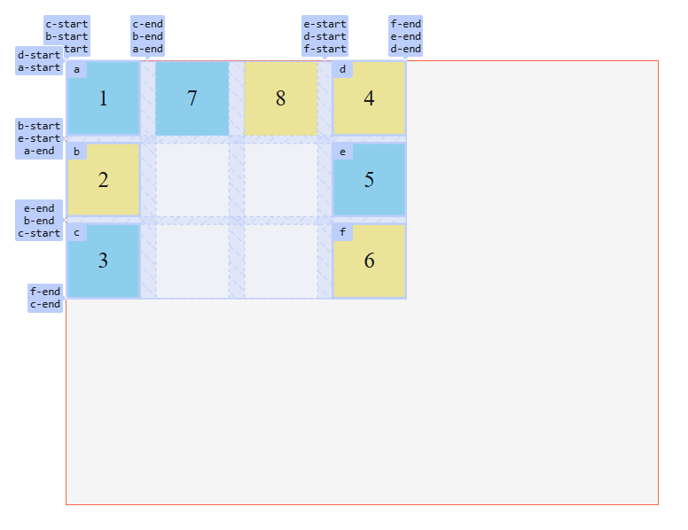
### `grid-auto-flow`

- determine the arrangement of the auto-placed grid items - whether it is row by row, or column by column.
- values:
  - `row` (default): go from left to right row by row
  - `column`: go from top to bottom column by column
  - `row dense`: row by row, fill the holes left by larger items. It may be a bit out of order.
  - `column dense`: column by column, fill the holes left by larger items. It may be a bit out of order.
### `grid-auto-rows` & `grid-auto-columns`
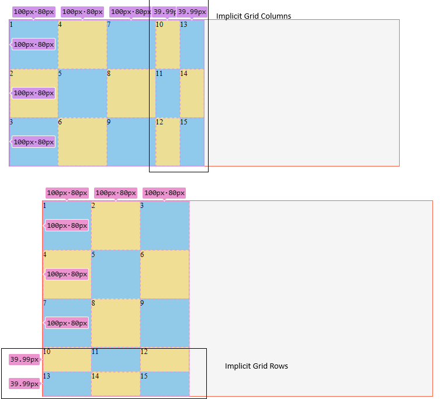
- What is explicit grid?
  - Grids defined via `grid-template-rows` and `grid-template-columns` that we explicitly specify the number of rows or columns, along with their size.
- What is implicit grid?
  - grid created outside the boundary set by the explicit grid defined by `grid-template-columns` and `grid-template-rows`.
  - The extra rows and columns created from the auto-layout algorithm are used to accomodate the extra grid items that falls outside the explicit grid.
- `grid-auto-columns`: set the width of implicitly-created grid column track.
- `grid-auto-rows`: set the height of implicitly-created grid row track.
- the writing is similar to `grid-template-rows` and `grid-template-columns`.
- When these two properties are not specified, the browser will decide the size of implicit columns/ rows based on the content size of the grid cell.


### `justify-items`, `align-items` & `place-items`
- `justify-items`: control the horizontal alignment of content in grid cells
- `align-items`: control the vertical alignment of content in grid cells
- values:
  - stretch (default)
  - center
  - start
  - end
- `place-items`: the shorthand property of `align-items` & `justify-items`.
  - values:
    - one value: the second value will be the same as the first value specified.
      - e.g., `place-items: center`
  - two value: `align-items` `justify-items`
    - e.g., `place-items: start center`

### `place-items`
- the shorthand property of `align-items` & `justify-items`.
- one value: the second value will be the same as the first value specified.
  - e.g., `place-items: center`
- two value: `align-items` `justify-items`
  - e.g., `place-items: start center`

### `justify-content`, `align-content` & `place-content`
- `justify-content`: control the horizontal alignment of the entire grid content area within the grid container.
- `align-content`: control the vertical alignment of the entire grid content area within the grid container.
- values:
  - start
  - end
  - center
  - stretch (This has no effect -> Why?)
  - space-around
  - space-between
  - space-evenly

### `grid-template` & `grid`
- `grid-template`: the shorthand of `grid-template-columns`, `grid-template-rows` and `grid-tmeplate-areas`.
- values:
  - `grid-template-rows / grid-template-columns values`
    - ```css
        /* Define 2 Rows: row height as 100px and 200prespectively. */
        /* Define 2 Columns: column width as 50px and 100px respectively */
        /* Number of Grid Items: 2 * 2 */
        /* Do not divide area */
        grid-template: 100px 200px/ 50px 100px;
    ```
  - `grid-template-areas grid-template-rows / grid-template-column values`
     - ```css
        /* Define 3 Rows: row height as 50px 100px and 50px respectively */
        /* Define 3 Columns: column width as 100px 100px 100px  */
        /* Divide area */

        grid-template:
          "a a b" 50px /* The first row height */
          "a a b" 100px /* The second row height */
          "c c c" 50px /* The third row height  *// 100px 100px 100px /* The column width for each column */;
        ```
- `grid`: the shorthand of `grid-template-columns`, `grid-template-rows`,`grid-tmeplate-areas`, `grid-auto-rows`, `grid-auto-columns`, and `grid-auto-flow`.
  - Note: it is a bit complicated and not really used in real case.


## Grid Item Properties

### `grid-column-start`, `grid-column-end`, `grid-row-start` & `grid-row-end`

- specify the grid item's start and end position in the grid.
  - `grid-column-start`: specifies the grid line where the item starts on the column axis.
  - `grid-column-end`: specifies the grid line where the item ends on the column axis.
  - `grid-row-start`: specifies the grid line where the item starts on the row axis.
  - `grid-row-end`: specifies the grid line where the item ends on the row axis.
  - shorthands:
    - `grid-row: start / end`
    - `grid-column: start / end`
- When an item is only used one of the four properties, the other properties will use default, and each item will only be occupying one grid cell, unless explicitly spanned across multiple rows or columns..
- values: 
  - **grid line number**
    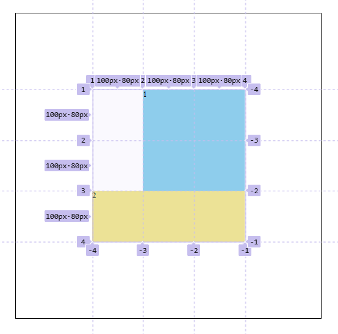
    - ```css
      .item1 {
        /* Use grid line number to specify the location   ofgrid item. */
        /* the number refers to grid line number. */
        /* Rows spans from 1 to 3 */
        grid-row-start: 1;
        grid-row-end: 3;
        /* Columns span from 2 to 4 */
        grid-column-start: 2;
        grid-column-end: 4;
      }
      .item2 {
        /* Rows spans from 3 to 4 */
        grid-row-start: 3;
        grid-row-end: 4;
        /* Columns span from 1 to 4 */
        grid-column-start: 1;
        grid-column-end: 4;
      }
      ```
  - **grid line name**
  - **span** keyword: how much cells the item spans from left to right (from top to bottom).
    - ```css
      /* Current item spans 3 rows.*/
      grid-row-start: span 3;
      ```
    - note: span has lower priority, CSS will calculate the position of item that use grid line number first, before position of items using span.
  - **auto**
    - have no effect, it is default, and it spans 1.
    - writing it is the same as not writing it.
    - example: you can set `grid-row-end`, and it will place the item 1 span from the end grid line number you specify.
  - **z-index**: Use to adjust the overlapping order of grid item. (this is not only used in positioned elements, it is used in grid items too!)

### `grid-area`
- use to assign grid item to a particular area.
- usages:
  - 1. work with the grid container property `grid-template-areas`.
    - ```css
      .grid-container {
        display: grid;
        /* Specify the areas and names. */
        grid-template-areas: 
        "a a b"
        "a a b"
        "c c e"
        ;
      }

      .grid .item.item1 {
        /* Work with grid-template-areas */
        /* Specify the location of item in a named area. */
        grid-area: a;
      }
      ```
  - 2. use as shorthand for `grid-row-start`, `grid-column-start`, `grid-row-end`, `grid-column-end`
    - `grid-area: <row-start> / <column-start> / <row-end> / <column-end>;`
  - 3. special use case: 12-column grid layout system:
    - ```css
      .grid-layout {
        /* Width as body width */
        display: grid;
        /* Divide the page into 12 fractions / columns */
        grid-template-columns: repeat(12, 1fr);
      }

      .col-1 {
        grid-area: auto / auto / auto / auto; /* span 1 */
      }

      .col-2 {
        grid-area: auto / auto / auto / span 2;
      }

      .col-3 {
        grid-area: auto / auto / auto / span 3;
      }

      .col-4 {
        grid-area: auto / auto / auto / span 4;
        background-color: tomato;
      }

      .col-5 {
        grid-area: auto / auto / auto / span 5;
        background-color: tomato;
      }

      .col-6 {
        grid-area: auto / auto / auto / span 6;
        background-color: tomato;
      }

      .col-7 {
        grid-area: auto / auto / auto / span 7;
        background-color: tomato;
      }

      .col-8 {
        grid-area: auto / auto / auto / span 8;
        background-color: tomato;
      }

      .col-9 {
        grid-area: auto / auto / auto / span 9;
        background-color: tomato;
      }

      .col-10 {
        grid-area: auto / auto / auto / span 10;
        background-color: tomato;
      }

      .col-11 {
        grid-area: auto / auto / auto / span 11;
        background-color: tomato;
      }

      .col-12 {
        grid-area: auto / auto / auto / span 12;
        background-color: tomato;
      }
     ```

### `justify-self` `align-self`， `place-self`

- `justify-self`: set the horizontal position of a particular grid cell content.
- `align-self`: set the vertical position of a particular grid cell content.
- `place-self`: shorthand of `align-self` & `justify-self`.
  - values:
    - 1. one value: the second value is same as the first value.
      - stretch (default)
      - start
      - end
      - center
    - 2. two values: `<align-self> <justify-self>`

## Compatibility

### 1. Browser CSS Prefixes

- `-webkit1-`: Chrome, Safari
- `-moz-`: Firefox
- `-o-`: Opera (old pre-WebKit versions)
- `-ms-`: IE, Microsoft Edge

> put properties with vendor prefixes first, standard ones put at the back.
> usually, new properties of CSS3 will have some compatibility issues.


1. vendor prefix on property name
- ```css
  .item {
    /* Compatibility */
    -webkit-transform: rotate(-3deg); /* Safari Chrome */
    -moz-transform: rotate(-3deg); /* Firefox */
    -ms-transform: rotate(-3deg); /* Edge */
    -o-transform: rotate(-3deg); /* Opera */
    /* Standard */
    transform: rotate(-3deg); 
  }
  ```

2. vendor prefix on value

- ```css
  .item {
    display: -webkit-flex; /* Safari Chrome */
    display: -moz-box; /* Firefox */
    display: -ms-flexbox; /* Edge */
    display: -webkit-box; /* OLD - IOS6-, Safari 3.1-6 */
  }
  ```

### 2. caniuse

check the compatibility of CSS properties on [caniuse website](https://caniuse.com/)

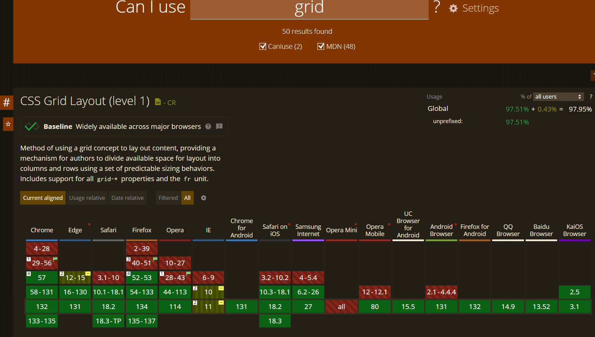

Search for the CSS property you interested, look for which versions of browsers are not supported.

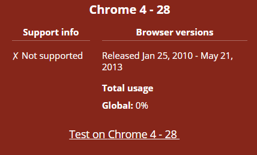
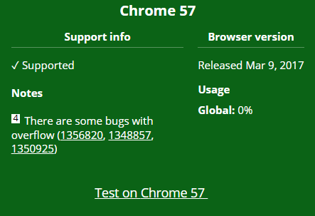
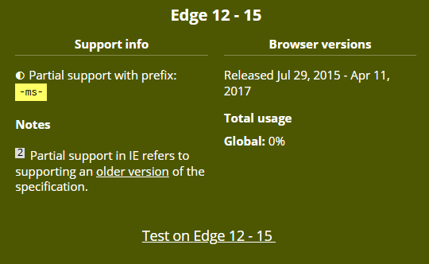

If it is partially supported in some browsers, look for prefixes that you can use.

### 3. Common Properties Requires Vendor Prefixes
Some CSS3 properties that may requires prefixes:
1. `display: flex / grid`: early versions may need `-webkit-`, `-moz-` or `-ms` to support.
2. `box-sizing`: early versions may require `-webkit-`
3.` border-radius / box-shadow`: add `-webkit-` and `-moz-` for early browsers using WebKit and Gecko core.
4. `text-shadow`: add `-webkit-` for early browsers.
5. `background-size`: add `-webkit-` to browsers using WebKit core.
6. `linear-gradient / radial-gradient`: add suitable prefix to browsers using WebKit and Gecko core.
7. `transition & animation`: add `-webkit-`, `-moz-`, `-o-` or `-ms-` to early browsers.
8.  `transform`: may require vendor prefixes.
9.  `transform-origin`: may require vendor prefixes.


- **Do not overuse prefixes**:  most current browsers already support these properties and may not need prefixes.
- **Use Autoprefixer plugin**: add prefixes automatically based on the browser versions you want to be compatible with, this saves us some troubles from manually writing them. Usually, this is coming with build tool.