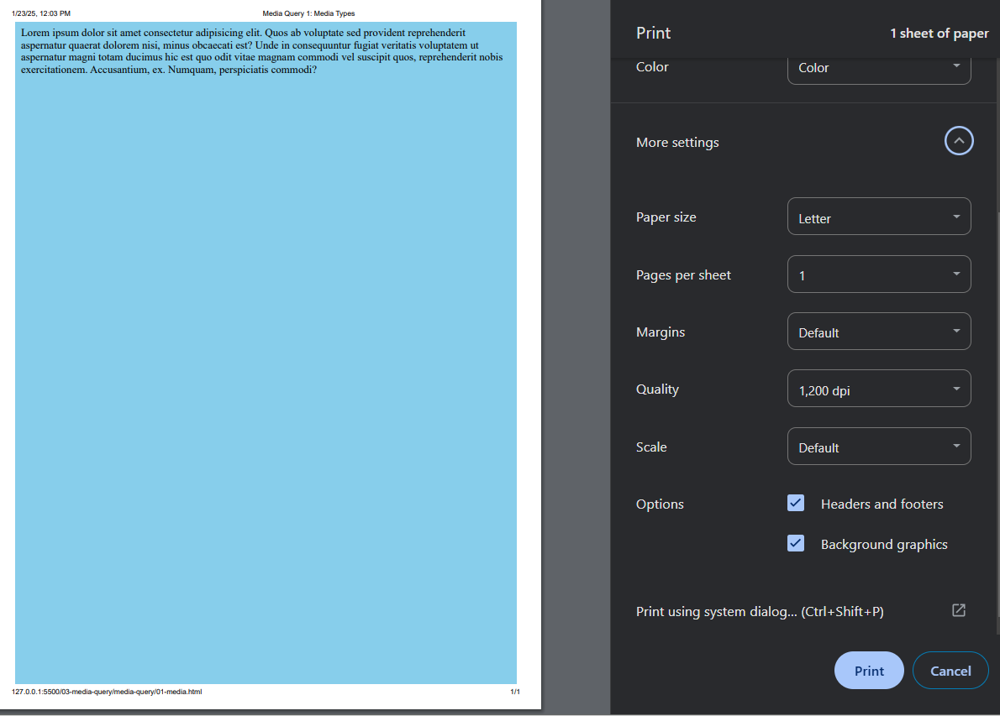
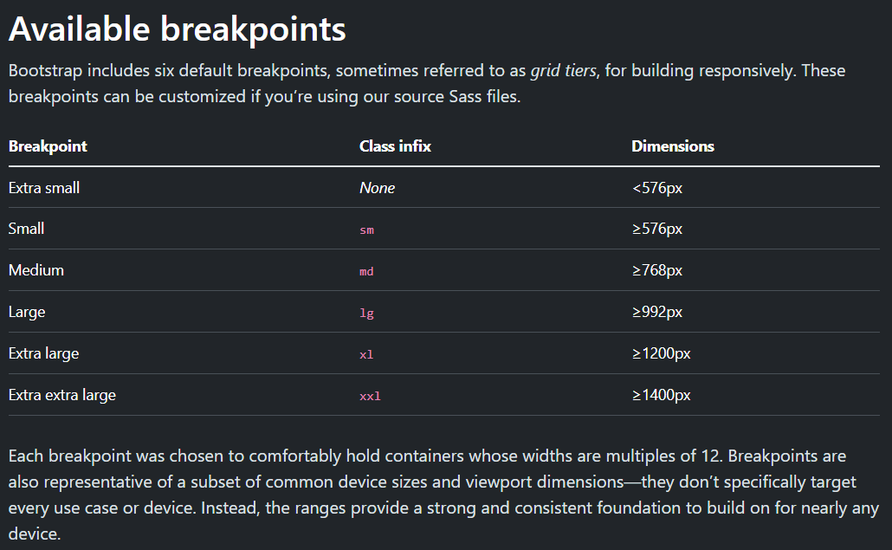

# Responsive Layout with Media Queries

1. `Responsive Layout`: A website design that adjusts and looks good on different screen sizes and devices.
2. `Responsive Design Principle`: through media queries to detect the viewport size (width, height, resolution or orientation) and applies specific styles or layouts based on that size, ensuring the website display suitable layout and content on various devices.
3. `Flow Layout with rem / vw units`: suitable for mobile devices with screen sizes ranged between 320 - 480px for better experience, and this is not suitable for iPad and PC as it has terrible experience.
4. Website built with responsive design can have better experience across various devices, usually for cost-saving purpose, and achieve perfection on each device is time-consuming and not always practical.

[Responsive design](https://developer.mozilla.org/en-US/docs/Learn_web_development/Core/CSS_layout/Responsive_Design)
[Media Query Fundamentals](https://developer.mozilla.org/en-US/docs/Learn_web_development/Core/CSS_layout/Media_queries)
[@media](https://developer.mozilla.org/en-US/docs/Web/CSS/@media)
## Media Queries Syntax

### 1. What is media query?

- A set of CSS styles is difficult to apply for different screen sizes. We need to write different styles targeting different screen size so that the webpage we design can be viewed normally in various screen sizes.
- media query is used to solve this problem, helping us detecting the viewport size, and applying suitable styles for various devices appropriately.

```css
/* 
    @media: media query
    screen: media type (screen devices)
    and: logical operator (AND - more conditions meet at the same time)
    min-width: media feature (device width >= 400px)
*/
@media screen and (min-width: 400px) {
    body {
        background-color: red;
    }
}
```

The example shows the complete media query syntax including:
- @media
- media type
- logical operator
- media feature

```css
@media mediaType logicalOperator (mediaFeature) {
    ...css
}
```


### 2. Media Types
- `all`: The default media type, compatible for all devices.
- `screen`: Used for devices with screens, such as PCs, mobile phones, TVs. (Focus)
- `print`: Applies to printed materials or content viewed under the print preview in browsers.
  - You must check the background graphics to see the effect.
   
- `speech`: Targets speech synthesizers (assistive technology for reading out content).

```css
@media mediaType {
    ...css
}
```
### 3. Media Features
- describe specific features / characteristics of user agent (browsers) that we want to detect.
- optional in media queries.
- test whether a specified feature exists or determine the value of the feature.
- each feature expression are enclosed in parentheses  `()`
- common media features:
    - `width`: screen width
    - `min-width`: >= value
    - `max-width`: <= value
    <!-- Mobile -->
    **Mobile: **
    - `-webkit-device-pixel-ratio`: dpr value
    - `-webkit-max-device-pixel-ratio`: max dpr value
    - `-webkit-min-device-pixel-ratio`: min dpr value
    - `orientation`: portrait / landscape
      - Note: Landscape when width > height

```css
/* Only media feature */
@media (mediaFeature) {
    ...css
}

/* Specify media type and media feature */
@media mediaType logicalOperator (mediaFeature) {
    ...css
}

/* Specify more than one media feature */
@media mediaType logicalOperator (mediaFeature1) logicalOperator (mediaFeature2) {
    ...css
}
```
### 4. Logical Operator
- compose a complex media query
- combine multiple media queries into a single rule by separating them with commas
- `and`: used to join features with media types or combine multiple media features together, requiring each chained feature to return true for the query to be true.
- `,`: used to combine multiple media queries into a single rule. Each query is treated as separate. If any of the queries returns true, the entire media statement returns true.
  ```css
    /* Comma / Or */
    /* Syntax */
    @media statement1, statement2 {
        ...css
    }
  
    /* Statement 1: screen and (min-width: 400px) */
    /* Statement 2: screen and (max-width: 375px) */
    @media screen and (min-width: 400px), screen and (max-width: 375px) {
        ...css
    }
  ```
- `not`: negate a media query. 
  - Note: it is used to negate the entire media statement, not an individual media feature expression.
  - must specify a media type (But according to MDN, it doesn't specify `not` requires media type.).
  ```css
    /* not: negate the entire media statement*/
    @media not statement {
  
    }
  
    /* Negate screen and (min-width: 375px) statement only. */
    @media not screen and (min-width: 375px), (max-width: 400px) {
        ...css
    }
  ```
- `only`: applies a style only if an entire query matches. Useful for preventing older browsers applying selected styles. E.g., older browsers would interpret `screen and (max-width: 500px)` as `screen`.
  - Must specify a media type.
  - Note: current browsers already support media query, so we can skip this.
- `or`: equivalent to comma.


## Responsive Breakpoints

- A point where the website's content responds to the device's width.
- For various devices with different screen sizes, we will have different breakpoint for each of them.
- In real world project, breakpoints are set based on project needs.
- Despite all that, the industry will have their own standard breakpoints for reference.
- For example, the following example are breakpoints from Bootstrap.

- ```css
    /* Note: CSS writing at the back will cover the CSS writing at the front. */
    /* They have same specificity. */
    /* Screen devices AND width >= 576px AND < 768 px*/
    @media screen and (min-width: 576px) {
      body {
        background-color: lightcoral;
      }
    }

    /* Screen devices AND width >= 768px AND < 992px */
    @media screen and (min-width: 768px) {
      body {
        background-color: green;
      }
    }

    /* Screen devices AND width >= 992px */
    @media screen and (min-width: 992px) {
      body {
        background-color: palegoldenrod;
      }
    }

    @media screen and (min-width: 1200px) {
      body {
        background-color: palevioletred;
      }
    }

    @media screen and (min-width: 1400px) {
      body {
        background-color: #008c8c;
      }
    }
    ```
## Where to put Media Queries?

- write in HTML style element
    ```html
    <style>
        <!-- ...Normal CSS -->
        
        <!-- ...Media Queries... -->
    </style>
    ```
- write in a separate CSS file and import via link element. 
    ```html
    <link rel="stylesheet" href="../css/media.css"/>
    ```
- write styles of different breakpoints in different css files (Not recommended)
  ```html
  <link rel="stylesheet" href="../css/a.css" media="screen and (min-width: 600px)"/>
  
  <link rel="stylesheet" href="../css/b.css" media="screen and (min-width: 1000px)"/>

  <!--  CSS files:
  
  /* a.css */

  body {
      background-color: skyblue;
  }

  /* b.css */

  body {
      background-color: red;
  }

  -->
  ```

- All media queries should be writing after all the CSS styles.
  - Avoid styles in media queries being overriden by normal styles when a particular breakpoint has reached.


## Two Common Responsive Design Strategies

- `Desktop-First Approach`: Consider PC before mobile.

  ```css
  .item {
    /* Width >= 1200px, display 6 images in a row */
    width: calc(100% / 6);
  }

  /* PC First Approach */
  /* Width <= 1200px, display 5 images in a row */
  @media screen and (max-width: 1200px) {
    .item {
      width: calc(100% / 5);
    }
  }

  /* Width <= 992px, display 4 images in a row */
  @media screen and (max-width: 992px) {
    .item {
      width: calc(100% / 4);
    }
  }

  /* Width <= 768px, display 3 images in a row */
  @media screen and (max-width: 768px) {
    .item {
      width: calc(100% / 3);
    }
  }

  /* Width <= 576, display 2 images in a row */
  @media screen and (max-width: 576px) {
    .item {
      width: calc(100% / 2);
    }
  }
  ```

- `Mobile-First Approach`: Consider mobile before PC.

  ```css
  .item {
    /* Width < 576px, display 2 images in a row */
    width: calc(100% / 2);
  }

  /* Mobile First Approach */
  /* Width >= 576px, display 3 images in a row */
  @media screen and (min-width: 576px) {
    .item {
      width: calc(100% / 3);
    }
  }

  /* Width >= 768px, display 4 images in a row */
  @media screen and (min-width: 768px) {
    .item {
      width: calc(100% / 4);
    }
  }

  /* Width >= 992px, display 5 images in a row */
  @media screen and (min-width: 992px) {
    .item {
      width: calc(100% / 5);
    }
  }

  /* Width >= 1200px, display 6 images in a row */
  @media screen and (min-width: 1200px) {
    .item {
      width: calc(100% / 6);
    }
  }
  ```
- The choice of PC-first or Mobile-first is based on your preference or maybe an agreement set by the company.

## Responsive Grid System

- BootStrap framework uses responsive grid system.
- Responsive Grid System = Grid Layout + Breakpoints + Responsive Design Strategy


### 1. Grid Layout

- divide a page or a container into several fractions and specify how many fractions the child element will occupy.
- Usually, a page or a container will be divided into: 12 fractions, 16 fractions or 24 fractions.
- If a page (100%) is divided into 12 fractions, then:
  - 1 fraction: 8.33333333%
  - 2 fractions: 16.66666667%
  - 3 fractions: 25%
  - 4 fractions: 33.33333333%
  - 5 fractions: 41.66666667%
  - 6 fractions: 50%
  - 7 fractions: 58.33333333%
  - 8 fractions: 66.66666667%
  - 9 fractions: 75%
  - 10 fractions: 83.33333333%
  - 11 fractions: 91.66666667%
  - 12 fractions: 100%
- study Bootstrap source code and you will realize that it uses this system.

### 2. Responsive Design with Grid Layout

Steps:
1. How many fractions you would like to divide your page?
- formula: `100% * fraction / total fractions`
- we decide the total fractions to be 12.
- calculate percentage of different fractions based on formula.
2. What are the breakpoints?
- \< 576px
- 576px - 768px (included)
- 768px - 992px (included)
- 992px - 1200px (included)
- \> 1200px
3. Choose a responsive design strategy? (PC-first or Mobile-first)
- we decide on PC-first approach.
4. Write corresponding CSS styles for grid layout based on breakpoints.
- write styles in media.css
- import media.css.
5. Develop based on design draft.

